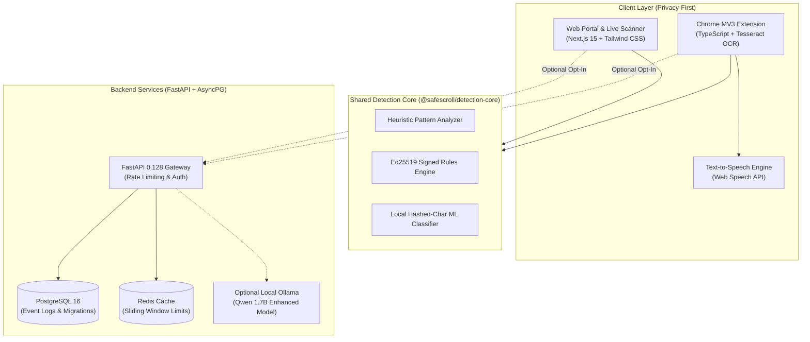

# SafeScroll 🛡️

<div align="center">

[](LICENSE)
[](https://nextjs.org/)
[](https://fastapi.tiangolo.com/)
[](https://www.python.org/)
[](https://www.typescriptlang.org/)
[](https://www.postgresql.org/)
[](https://redis.io/)
[](https://playwright.dev/)
[](CONTRIBUTING.md)

**A calm, explainable, and privacy-first digital safety assistant that protects people from modern cyber scams before they click.**

[Features](#-key-features) •
[Architecture](#-system-architecture) •
[Quick Start](#-quick-start) •
[Live Scanner](#-interactive-security-scanner) •
[API Reference](#-api-reference) •
[Security](#-security--privacy-architecture) •
[Testing](#-testing--quality-assurance)

</div>

---

## 📖 Overview

Today's cyber scams, fake bank alerts, credential phishing traps, and impersonation schemes **no longer look fake**. Ordinary users, elderly family members, and non-technical people face aggressive social engineering every day.

**SafeScroll** provides a calm second thought before taking a risky action. Instead of overwhelming users with cryptic cybersecurity jargon or selling their data, SafeScroll combines **local-first heuristics**, **client-side OCR**, **signed rulesets**, and **plain-language explainability** to deliver transparent risk assessments and actionable next steps.

---

## ✨ Key Features

- 🔒 **Privacy-First (ZERO Mode):** Your private messages stay private. Content analysis, heuristic checks, OCR, and rules run directly on your device. Zero mandatory cloud transmission and zero raw message storage.
- 🧠 **Explainable AI (XAI):** See the exact reasons, evidence weights (e.g., urgency flags, OTP requests, deceptive domains), and plain-language breakdown instead of a mysterious numeric score.
- 📸 **On-Device OCR:** Client-side optical character recognition via Tesseract.js extracts and scans text directly from screenshots, payment receipts, and fake notification captures.
- 🗣️ **Senior-Friendly & Accessibility:** Built-in Text-to-Speech (TTS) audio narration reads warnings aloud for elderly and visually impaired users.
- 🔏 **Cryptographically Signed Rules:** Safety rules are validated using Ed25519 signatures to prevent rule tampering or rogue injection.
- ⚡ **Cross-Platform Ecosystem:**
  - **Web Application:** Modern, responsive Next.js landing and live security scanner.
  - **Browser Extension:** Manifest V3 Chrome extension providing in-page contextual warnings.
  - **Backend API:** High-throughput FastAPI engine with async PostgreSQL, Redis caching, and rate limiting.
  - **Admin Console:** Telemetry, audit log review, and rule governance dashboard.
  - **Optional Enhanced AI:** Local LLM integration via Ollama (`qwen3:1.7b`) for deep conversational safety analysis.

---

## 🏛️ System Architecture



---

## 📂 Repository Structure

SafeScroll is structured as a unified monorepo managed with **pnpm** and **Python**:

```
safescroll/
├── apps/
│   ├── web/               # Next.js 15 User Interface & Live Scanner (Port 3000)
│   ├── admin/             # Next.js 15 Operator & Governance Dashboard (Port 3001)
│   ├── api/               # FastAPI Python Backend Service (Port 8000)
│   └── extension/         # Chrome MV3 Browser Extension (Vite + TypeScript)
├── packages/
│   ├── detection-core/    # Shared TypeScript scam detection algorithms & heuristics
│   └── rules/             # Ed25519-signed scam pattern rule definitions
├── infra/                 # Docker Compose (PostgreSQL, Redis) and deployment baselines
├── ml/                    # Small character-level model training & evaluation scripts
├── tests/
│   └── e2e/               # Playwright Chromium end-to-end integration tests
└── scripts/               # Automation, rule signing, verification, and smoke tests
```

---

## 🚀 Quick Start

### Prerequisites

- **Node.js:** `>= 20.18.0` (Recommended: v22 or v24 LTS)
- **pnpm:** `>= 10.0.0`
- **Python:** `>= 3.12`
- **PostgreSQL & Redis** (Local services or Docker)

---

### 1. Clone & Install Dependencies

```bash
git clone https://github.com/raitulh/SafeScroll.git
cd SafeScroll

# Install all JavaScript/TypeScript monorepo dependencies
pnpm install

# Build the shared detection core package
pnpm --filter @safescroll/detection-core build
```

---

### 2. Configure Environment

Copy example environment variables:

```bash
cp .env.example .env
```

---

### 3. Setup Python Backend

```bash
# Navigate to the API workspace
cd apps/api

# Install dependencies in editable mode
python -m pip install -e .

# Run database migrations
python -m alembic upgrade head

# Start the FastAPI backend server
python -m uvicorn app.main:app --host 127.0.0.1 --port 8000 --reload
```

> **API Server:** [http://127.0.0.1:8000](http://127.0.0.1:8000)  
> **Interactive Swagger Docs:** [http://127.0.0.1:8000/docs](http://127.0.0.1:8000/docs)

---

### 4. Start Web Application

In another terminal window:

```bash
# Start Next.js Web Frontend
pnpm dev:web
```

> **Web Application:** [http://127.0.0.1:3000](http://127.0.0.1:3000)  
> **Live Security Scanner:** [http://127.0.0.1:3000#scanner](http://127.0.0.1:3000#scanner)

---

### 5. Start Admin Portal

```bash
# Start Next.js Admin Dashboard
pnpm dev:admin
```

> **Admin Portal:** [http://127.0.0.1:3001](http://127.0.0.1:3001)

---

### 6. Build the Chrome MV3 Extension

```bash
# Prepare OCR assets and bundle the extension
pnpm prepare:extension
pnpm build:extension
```

1. Open Google Chrome and navigate to `chrome://extensions`.
2. Toggle on **Developer mode** (top right corner).
3. Click **Load unpacked** and select `apps/extension/dist`.

---

## 🔍 Interactive Security Scanner

The built-in Live Scanner analyzes unstructured communications in real-time.

```
[ INPUT ]
"Urgent: Your bank account is locked due to unusual activity.
 Send your OTP immediately to verify: http://secure-bank-login.top"

[ ANALYSIS ]
Assessment:   🔴 SCAM
Risk Score:   64 / 100
Category:     otp_phishing
Language:     English (Multi-lingual supported, including Bengali)

[ EVIDENCE ]
• Requests a private security code (+28)
• Creates urgency or pressure (+18)
• The link does not use HTTPS (+8)

[ ACTIONS ]
1. Do not click the link.
2. Do not share an OTP, PIN, password, or card details.
3. Verify through an official website or phone number you already trust.
```

---

## 📡 API Reference

### Health Check

```http
GET /api/v1/health
```

**Response (200 OK):**
```json
{
  "status": "ok",
  "service": "safescroll-api",
  "version": "1.0.0"
}
```

### Scan Text or Links

```http
POST /api/v1/scan/text
Content-Type: application/json

{
  "content": "You have won $5,000! Click here immediately to claim your prize.",
  "enhanced": false
}
```

**Response (200 OK):**
```json
{
  "severity": "SCAM",
  "score": 58,
  "category": "prize_scam",
  "evidence": [
    { "code": "prize_bait", "label": "Claims unexpected prize or money", "weight": 25 },
    { "code": "urgency", "label": "Creates urgency or pressure", "weight": 18 }
  ],
  "explanation": "This message exhibits classic prize fraud patterns, demanding immediate action to claim funds.",
  "actions": [
    "Never send money or credentials to collect a prize.",
    "Block and report the sender."
  ],
  "language": "en",
  "scan_id": 14,
  "engine_version": "1.0.0"
}
```

---

## 🔒 Security & Privacy Architecture

- **Argon2 Password Hashing:** Industry-standard password hashing with memory and iteration parameters (`argon2-cffi`).
- **Cryptographic Ed25519 Signatures:** Remote rule bundles are signed with Ed25519 private keys and verified before injection.
- **Sliding-Window Rate Limiting:** Enforced at the gateway layer via Redis to mitigate automated scraping and denial-of-service vectors.
- **Strict Content Security:** Non-root execution containers, automated SQL parameterization with SQLAlchemy async sessions, and zero raw PII storage by default.

---

## 🧪 Testing & Quality Assurance

SafeScroll maintains **100% passing test coverage** across all monorepo workspaces:

```bash
# Run all unit test suites across all packages (Vitest)
pnpm test

# Run backend security and API tests (Pytest)
pnpm security

# Run End-to-End browser tests (Playwright Chromium)
pnpm e2e

# Run smoke tests
node scripts/smoke-test.mjs

# Run release and asset integrity checks
node scripts/release-check.mjs
```

---

## 🛠️ Technology Stack

| Component | Technologies |
|---|---|
| **Web Frontend** | Next.js 15 (App Router), React 19, Tailwind CSS 4, Three.js / R3F |
| **Browser Extension** | Chrome MV3, TypeScript, Vite, Tesseract.js, Web Speech API |
| **Detection Core** | TypeScript, Ed25519 Cryptography, Char-Hashing Heuristics |
| **Backend Engine** | Python 3.12, FastAPI, SQLAlchemy 2.0 Async, Alembic |
| **Data & Cache** | PostgreSQL 16, Redis |
| **Testing** | Vitest, Pytest, Playwright |
| **Tooling & CI** | pnpm workspaces, Docker, Ruff, Prettier, Prometheus |

---

## 🤝 Contributing

Contributions make the open-source community a better place to learn, inspire, and create. Any contributions you make are **greatly appreciated**.

1. Fork the Project
2. Create your Feature Branch (`git checkout -b feature/AmazingFeature`)
3. Commit your Changes (`git commit -m 'Add some AmazingFeature'`)
4. Push to the Branch (`git push origin feature/AmazingFeature`)
5. Open a Pull Request

---

## 📄 License

Distributed under the **MIT License**. See [`LICENSE`](LICENSE) for more information.

---

<div align="center">

**SafeScroll** — *Before you click, know what you're looking at.*

Made with ❤️ for a safer, scam-free web.

</div>
